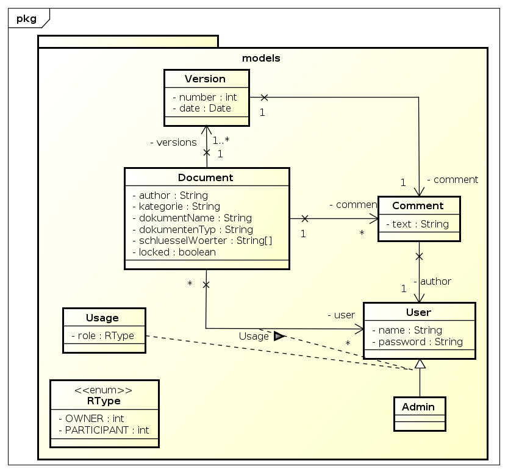

############################
Dokumenten Management System
############################

======
Angabe
======

Ein Dokumenten Management System (kurz DMS genannt) erlaubt das zentrale
Speichern von beliebigen Dokumenten. Dokumente können somit gezielt an
einem Platz gesucht und administriert werden. Eine zentrale Aufgabe eines
DMS ist es den Verlauf eines Dokuments aufzuzeichnen und jederzeit abrufen
zu können.

~~~~~~~~~~~~~~~~~~~
Suche - Indizierung
~~~~~~~~~~~~~~~~~~~

Ein DMS ist nur so gut, wie seine Suchfunktion. 
Es soll daher möglich sein nach folgenden Parametern zu suchen.

* Autor

* Kategorie

* Kommentar

* Dokumentname

* Dokumenttyp

* Schlüsselwörter

Diese Parameter beschreiben auch die Eigenschaften eines Dokuments in dem DMS.

~~~~~~~~~~~~~~~~~~~~~~~~~~~~~~~~
Authentifikation - Autorisierung
~~~~~~~~~~~~~~~~~~~~~~~~~~~~~~~~

Bei dem DMS soll es sich um ein rollenbasiertes System handeln.
Folgende Rollen sollen im System implementiert werden:

* Administrator:
  Der Administrator hat alle Rechte und kann auf alle Dokumente zugreifen.

* Dokumentbesitzer:
  Jener Benutzer der ein Dokument im DMS erstmalig erfasst, wird als Dokument
  Besitzer vermerkt.

* Dokumentnutzer: Der Administrator und der Dokumentbesitzer kann beliebigen
  andere Benutzer den Zugriff auf das Dokument gewähren.

Zur Vereinfachung wird beim Zugriff nicht zwischen Lese- und Schreibrechten
unterschieden, sprich Zugruff auf ein Dokument bedeutet Lese- und
Schreibzugriff.

~~~~~~~
Verlauf
~~~~~~~

Für jedes Dokument in dem DMS soll mit einer Versionsnummer versehen und
gespeichert werden. Jede Änderung des Dokuments führt dazu, dass die
Versionsnummer um eins erhöht wird. Alle Änderungen werden mit folgenden
Parameter im DMS gespeichert:

* Versionsnummer

* Benutzer

* Datum / Uhrzeit

* Kommentar

~~~~~~~~~~~~~~~~~
Upload - Download
~~~~~~~~~~~~~~~~~

Das DMS soll in dieser Version folgende Aktionen erlauben:

* Upload:
  Ein neues bzw. eine neue Version eines Dokuments werden im DMS abgelegt
  und die Versionsnummer wird um eins erhöht. Ebenso wird der Verlauf um diese
  Aktion erweitert. Wenn das Dokument zuvor von dem Benutzer heruntergeladen
  wurde, so führt der Upload zu einer Freigabe des Dokuments, wodurch anderen
  Dokumentennutzer das Dokument bearbeiten können. Es kann immer nur ein
  Dokument hochgeladen werden. Ein Hochladen mehrerer Dokumente bzw. ganzer
  Verzeichnisstrukturen sind in der nächsten Ausbaustufe angedacht.

* Checkout / Download:
  Ein Checkout eines Dokuments führt gleichzeitig dazu, dass das Dokument im
  DMS als GESPERRT vermerkt wird. Diese Sperre gilt für alle anderen Benutzer
  und kann nur von dem Dokumentnutzer durch einen UPLOAD einer neuen Version
  bzw. mit Hilfe der GUI durch den Dokumentbesitzer bzw. Administrator
  freigegeben werden.

* Löschen
  Ein bestehendes Dokument kann nur gelöscht werden, wenn es nicht gesperrt
  ist. Das Löschen des Dokuments erfolgt auch physisch und führt dazu das
  alle Einträge im DMS (Bsp. Verlauf, Dokumentbenutzer, etc.) gelöscht werden.

Erstelle mit Hilfe der **Frameworks JEE oder Play** eine Webapplikation,
die die Funktionalität dieses Dokumentenmanagementsystems abbildet.
Verwende das **ORM Framework Hibernate** um die Daten des Dokuments in einer
**Datebank** abzuspeichern. Führe zu Beginn der Arbeit eine ausführliche
**Analyse & Designphase** durch, um die Problem noch vor der Implementierung
mit den Projektmitgliedern abzuklären.

=======
Planung
=======

=========
Benutzung
=========

~~~~~~~~~
Activator
~~~~~~~~~

Das abgegebene Sourcerelease enthält neben Code und dokumentation auch eine 
portable Version des Build und Deploymenttools **activator** für Windows und
Linux systeme. Zur benutzung ist nur ein korrekt installiertes 
**Java Development Kit** notwendig (minimal Java 7, Systempfade müssen 
gesetzt sein)

Unter Windows lässt sich der **activator** folgender weise starten:

.. code:: cmd

    activator.bat

Unter Linux folgender weise:

.. code:: bash

    ./activator

Im folgenden wird der aufruf von activator auf:

.. code:: bash

    activator

Dieser Aufruf ist auch eine Option wenn der activator Systemweit installiert
wurde.

Mit dem Aufruf von ``activator tasks`` können alle möglichen Tasks angezeigt
werden.

~~~~~~~~~~
Deployment
~~~~~~~~~~

Für uns von bedeutung ist der Task ``activator run``. Mit diesem Task werden
alle Schritte unternommen um die Applikation ausführen zu können.
Nachdem abhängigkeiten geladen wurden und der Code kompiliert wurde wird ein
Application Server auf ``localhost:9000`` gestartet. Die Applikation lässt
sich über diese Addresse im Webbrowser öffnen.

~~~~~~~~~~~~~~~~~~~~~~~~~~~~
Benutzung der Webapplikation
~~~~~~~~~~~~~~~~~~~~~~~~~~~~

Die Startseite, zu beginn existiert noch kein Account.

Versucht man sich einzuloggen.

So schlägt dies fehl.

.. image:: doc/Screen4.png
    :width: 30%

Es gibt keine graphische Oberfläche zum erstellen eines Benutzers.
Ein neuer Benutzer muss wie am Bild gezeigt über änderung der Url
angelegt werden.

So sieht es aus wenn der Benutzer erfolgreich erstellt wurde.

So wenn das erstellen fehlschlägt. In diesem Fall weil der Benutzer bereits
existiert.

Jetzt von der benutzer angelegt wurde kann man sich auch einloggen.

Eingeloggter Benutzer wird begrüßt.

Nach dem Logout.

=====
Fazit
=====

Play bietet seiner ``routes`` Datei einen sehr ergonomischen Weg
Webapplikationen erstellen, HTML Templates mit Scala sind nach etwas
Eingewöhnungszeit auch ein echter Gewinn.

Allerdings mussten wir uns viel zu
viel mit der Play spezifischen Magie herumschlagen. Applikation die im einen
Moment noch funktioniert haben konnten ohne Code-Änderungen nur weniger Minuten
später nicht mehr ausgeführt werden.

Durch die Eigenheit von Play, das ein Teil des Codes zur Laufzeit oder gar
zur Compilezeit zu generieren, ist ein Debugging solcher Probleme nur sehr
schwer möglich.

Ein weiteres Problem von Play ist der hohe Ressourcen bedarf.
Der Application Server hatte öfter Probleme weil ihm das zugewiesene 1 GiB RAM
nicht genug war.

Ein anderer Fall war dass der Play Activator alle INotify Watches unter Linux
aufgebraucht hatte. Er ist darauf mit einer nur bedingt hilfreichen
Fehlermeldung abgestürzt. Hätten wir nicht bereits Erfahrung mit dem Problem
von zu wenigen INotify Watches gesammelt, so hätten wir dieses Problem kaum
lösen können.

Alles in allem ist Play wohl eine Technologie mit der sich sehr schnell 
Anwendungen entwickeln lassen, sobald man mal mit den Fallstricken vertraut 
ist. Bis das dahin können diese Probleme aber eine Menge Zeit kosten.

.. header::

    +-------------+-------------------+------------+
    | ###Title### | Andreas Willinger | 2014-06-11 |
    |             | Jakob Klepp       |            |
    +-------------+-------------------+------------+

.. footer::

    ###Page### / ###Total###
